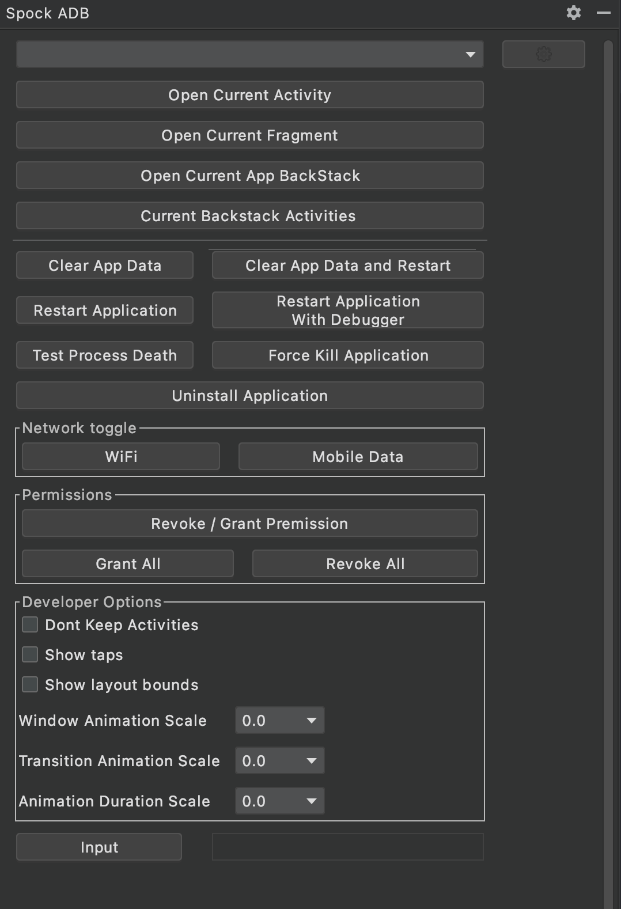

[](https://app.codacy.com/manual/WahdanZ/SpockAdb?utm_source=github.com&utm_medium=referral&utm_content=WahdanZ/SpockAdb&utm_campaign=Badge_Grade_Dashboard)


 

# SpockAdb 
<!-- Plugin description -->
Plugin Helps you to have full control of your project and device.
<!-- Plugin description end -->


## **Features**
 - Navigate to current active activity in your IDE
 -  Current BackStack Activities 
 -  Navigate to current  active fragments 
 -  Clear application data 
 -  Enable and Disable Permissions of your application
 - Kill or Restart Application
- Restart app with debugger 
- Uninstall and Clear App Data and Restart
 - Toggle "Show Taps" setting;
 - Toggle "Show Layout Bounds" setting;
 - Toggle "Don't Keep Activities" setting;
 - Adds option to Grant or Revoke all app permissions at once.

 - Change scale of:
   - Window Animation;
   - Transition Animation;
   - Animator Duration.

## Screenshot



## Download

https://plugins.jetbrains.com/plugin/11591-spock-adb

## Demo

[](http://www.youtube.com/watch?v=x_WX_Pznqos)


```
Copyright 2019 Ahmed Wahdan

Licensed under the Apache License, Version 2.0 (the "License");
you may not use this file except in compliance with the License.
You may obtain a copy of the License at

   http://www.apache.org/licenses/LICENSE-2.0

Unless required by applicable law or agreed to in writing, software
distributed under the License is distributed on an "AS IS" BASIS,
WITHOUT WARRANTIES OR CONDITIONS OF ANY KIND, either express or implied.
See the License for the specific language governing permissions and
limitations under the License.
```
