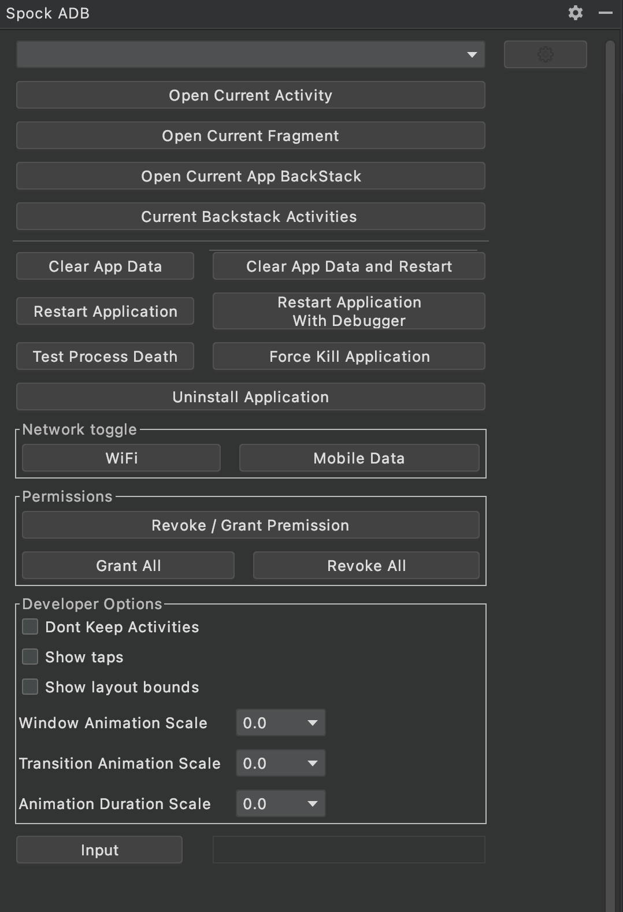

[](https://app.codacy.com/manual/WahdanZ/SpockAdb?utm_source=github.com&utm_medium=referral&utm_content=WahdanZ/SpockAdb&utm_campaign=Badge_Grade_Dashboard)


# Spock ADB

<!-- Plugin description -->
Full control of your Android device directly from your IDE — no terminal needed.

Spock ADB puts the most common ADB workflows into a single tool window: navigate to the active Activity or Fragment in your editor, manage app lifecycle, toggle developer settings, control permissions, stream logcat, and run ADB commands — all with one click.

It also ships an <b>Android MCP server</b>: give Claude Code, Claude Desktop, Cursor or any MCP client safe, structured access to a connected device. 26 strongly typed tools rather than a raw shell, and anything destructive asks you first, every time.

Works in Android Studio and IntelliJ IDEA.
<!-- Plugin description end -->

---

## Features

### Navigation
| Feature | Description |
|---|---|
| **Open Current Activity** | Jump directly to the currently visible Activity in your editor |
| **Open Current Fragment** | Jump directly to the currently visible Fragment (supports nested fragments) |
| **Current App Back Stack** | View the full back stack of Activities and Fragments for the foreground app |
| **Back Stack (All Apps)** | View the system-wide Activity back stack across all running apps |

### App Lifecycle
| Feature | Description |
|---|---|
| **Restart App** | Stop and relaunch the foreground application |
| **Restart with Debugger** | Relaunch and immediately attach the debugger |
| **Test Process Death** | Kill the app process without removing it from recents (tests background restore) |
| **Force Kill** | Hard kill the application process |
| **Clear App Data** | Wipe all app data (shared prefs, databases, cache) |
| **Clear App Data & Restart** | Wipe all app data and immediately relaunch |
| **Uninstall App** | Remove the application from the device |

### Permissions
| Feature | Description |
|---|---|
| **Revoke / Grant Permission** | Toggle individual runtime permissions via a checkbox dialog |
| **Grant All** | Grant every declared runtime permission at once |
| **Revoke All** | Revoke every declared runtime permission at once |

### Developer Options
| Feature | Description |
|---|---|
| **Open Developer Options** | Launch the system Developer Options screen |
| **Don't Keep Activities** | Read current state of the "Don't Keep Activities" setting |
| **Show Taps** | Toggle the "Show Taps" developer setting |
| **Show Layout Bounds** | Toggle the "Show Layout Bounds" developer setting |
| **Window Animation Scale** | Set window animation scale (0×, 0.5×, 1×, 1.5×, 2×, 5×, 10×) |
| **Transition Animation Scale** | Set transition animation scale |
| **Animator Duration Scale** | Set animator duration scale |

### Network
| Feature | Description |
|---|---|
| **Toggle Wi-Fi** | Enable or disable Wi-Fi on the device |
| **Toggle Mobile Data** | Enable or disable mobile data on the device |

### Utilities
| Feature | Description |
|---|---|
| **Input Text** | Type text into the focused field on the device |
| **Open Deep Link** | Fire an `android.intent.action.VIEW` intent with any URI |

### Logcat
| Feature | Description |
|---|---|
| **Live logcat** | Stream the device log, scoped to the app in the open project |
| **Presets** | Current app, Errors only, Crashes, ANRs, Network |
| **Filtering** | Log level, tag, plain-text or regex search, filter by process |
| **Crash highlighting** | Fatal exceptions, native crashes and ANRs are colour-coded |
| **Pause / resume / clear** | Freeze the view without losing the stream |
| **Copy & export** | Copy selected lines, or export the buffer to a file |

### ADB Command Center
| Feature | Description |
|---|---|
| **Run any ADB shell command** | With a real timeout and a working Cancel button |
| **History & favourites** | Recent commands, and the ones you keep coming back to |
| **Searchable output** | Find text in long `dumpsys` dumps |
| **Copy command / copy output / clear** | One click each |
| **Confirmation on dangerous commands** | Destructive commands are flagged before they run |

### UI Inspector (Views & Jetpack Compose)
| Feature | Description |
|---|---|
| **Semantics tree** | Inspect what is on screen, as a hierarchy you can browse and search |
| **Framework detection** | Says whether the screen is Views, Jetpack Compose, or both |
| **Compose test tags** | Shows them when available, and tells you how to expose them when not |
| **Node details** | Test tag, text, content description, bounds, and every interactive flag |
| **Accessibility audit** | Unlabelled controls, small touch targets, duplicate labels — with Compose-level fixes |

### AI agents (MCP)
| Feature | Description |
|---|---|
| **Android MCP server** | Expose the device to Claude Code, Claude Desktop, Cursor or any MCP client |
| **36 typed tools** | Devices, packages, app lifecycle, permissions, Activity/Fragment, logcat, screenshots, UI tree, semantic interaction, assertions |
| **Jetpack Compose first-class** | Semantics-based UI tree that identifies Views / Compose / hybrid, with element-addressed tap, scroll, input and assertions — no Compose dependency, no pinned version |
| **Accessibility audit** | Unlabelled controls, small touch targets, duplicate labels — with Compose-level fixes |
| **MCP Server panel** | Status, start/stop/restart, copy config — a tab, not a buried setting |
| **Live activity monitor** | Every agent request with safety marker, outcome and duration; expand for arguments and result |
| **Searchable history** | Filter by tool and outcome; bounded, with a configurable size |
| **Safety model** | Destructive tools always ask, per call, and default to denied |
| **Off by default** | Started explicitly from `Tools → SpockAdb` |

### Actions & keyboard shortcuts
| Feature | Description |
|---|---|
| **Everything is an IntelliJ Action** | Discoverable through Find Action, listed in `Settings → Keymap → Spock ADB` |
| **Assign your own shortcuts** | Native Keymap — no custom shortcut system |
| **No defaults shipped** | The plugin will never silently claim a combination you already use |
| **Context-aware** | Actions disable themselves and say why: *"no Android device connected"* |

See **[docs/MCP.md](docs/MCP.md)** for setup, the tool list, the safety model and example agent workflows.

---

## Screenshot



---

## Supported IDEs

| IDE | Versions |
|---|---|
| **Android Studio** | 2023.1 (Hedgehog) and later |
| **IntelliJ IDEA** | 2023.1 and later, with the bundled Android plugin |

Every release is checked against both IDEs with JetBrains Plugin Verifier before it ships.
See [docs/COMPATIBILITY.md](docs/COMPATIBILITY.md) for the full matrix and the reasoning
behind the supported range.

> **Note:** `Restart App With Debugger` requires the Android Studio execution tooling. It is
> available in all supported Android Studio versions and in IntelliJ IDEA 2025.1+, and is
> hidden automatically on IDEs that do not ship it. Every other feature works everywhere.

---

## Documentation

| Document | Contents |
|---|---|
| [docs/MCP.md](docs/MCP.md) | Android MCP server: setup, tools, safety model, agent workflows |
| [docs/COMPATIBILITY.md](docs/COMPATIBILITY.md) | Supported IDE range, verification matrix, how to change it safely |
| [CONTRIBUTING.md](CONTRIBUTING.md) | Development setup, threading rules, release process |
| [CHANGELOG.md](CHANGELOG.md) | Release history |

---

## Installation

**JetBrains Marketplace:** [Spock ADB](https://plugins.jetbrains.com/plugin/11591-spock-adb)

Or install directly from your IDE: `Settings → Plugins → Marketplace → search "Spock ADB"`

---

## Demo

[](http://www.youtube.com/watch?v=x_WX_Pznqos)

---

## License

```
Copyright 2019 Ahmed Wahdan

Licensed under the Apache License, Version 2.0 (the "License");
you may not use this file except in compliance with the License.
You may obtain a copy of the License at

   http://www.apache.org/licenses/LICENSE-2.0

Unless required by applicable law or agreed to in writing, software
distributed under the License is distributed on an "AS IS" BASIS,
WITHOUT WARRANTIES OR CONDITIONS OF ANY KIND, either express or implied.
See the License for the specific language governing permissions and
limitations under the License.
```
