

  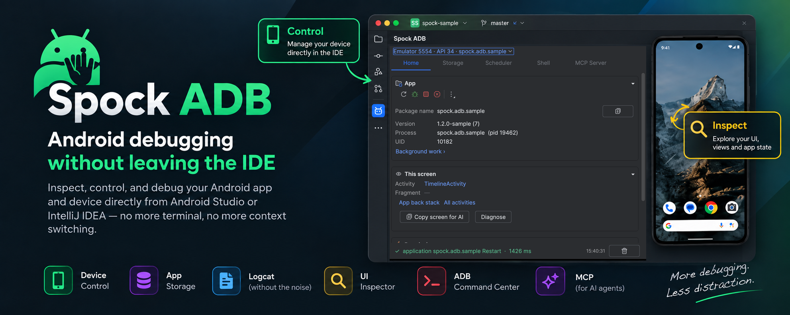

  
  
  

# Spock ADB

## Android debugging without leaving the IDE

<!-- Plugin description -->
**Inspect, control, and debug your Android app and device directly from Android Studio or IntelliJ IDEA — without constantly switching to the terminal, Device Manager, Settings, or external tools.**

Spock ADB brings ADB workflows into the IDE and keeps one selected device and app as the active target across Home, Storage, Work, Shell, Logcat, the Debug Timeline, Diagnose and the UI Inspector — plus a built-in MCP server exposing 67 strongly typed Android tools for Claude Code, Claude Desktop, Cursor, and other AI clients.
<!-- Plugin description end -->

**One IDE · One device target · Fewer ADB commands**

  <a href="https://plugins.jetbrains.com/plugin/11591-spock-adb"><strong>Install from JetBrains Marketplace</strong></a> ·
  <a href="docs/MCP.md"><strong>View Documentation</strong></a>

  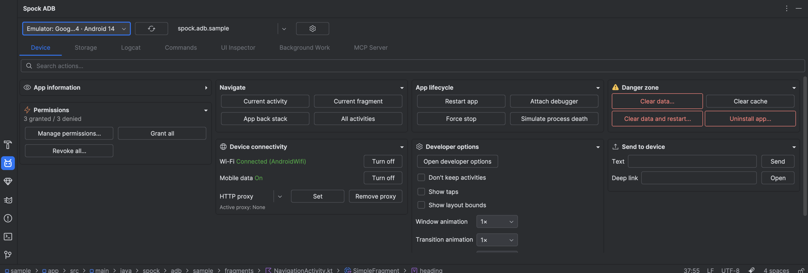

---

## Contents

- [Stop jumping between tools](#stop-jumping-between-tools)
- [Everything you need for Android debugging](#everything-you-need-for-android-debugging)
  - [🏠 Home: the app, its screen and the device](#device-control)
  - [🔔 Push messages](#push-messages)
  - [🗂 App Storage](#app-storage)
  - [📜 Logcat, without the noise](#logcat)
  - [⌨️ Shell](#adb-command-center)
  - [🩺 Diagnose Current Screen](#diagnose)
  - [🕒 Debug Timeline](#debug-timeline)
  - [🔍 UI Tree](#ui-inspector)
  - [⏱ Scheduler](#background-work)
  - [⚡ Spock Actions](#spock-actions)
  - [🤖 Android debugging for AI agents](#ai-agents)
- [Why use Spock ADB?](#why-use-spock-adb)
- [Built for real debugging workflows](#built-for-real-debugging-workflows)
- [Get started](#get-started)
- [Documentation](#documentation)
- [License](#license)

---

## Stop jumping between tools

A normal Android debugging session can quickly become:

`Android Studio → Terminal → adb → Logcat → Device Settings → back to Android Studio`

Spock ADB brings those workflows into the IDE and keeps one selected **device + app** as the target of everything it does. It is laid out by what each part is for:

- **Status bar** — the device and app every Spock surface acts on (it follows Android Studio's run target by default), and whether the MCP server is on.
- **Spock ADB** (left) — **Home** (the app, the screen it is on, its permissions, device controls), **Storage**, **Scheduler** and **Shell**.
- **Spock Logcat** (bottom) — the app's log and the **Debug Timeline**, beside the actions that produce them.
- **Spock Screen** (left, above Spock ADB) — **Diagnose** and the **UI Tree** of the screen in front of you.
- **⚡ Spock Actions** (main toolbar) — every action, searchable, with pins and recents; bind it to a shortcut in the keymap.

  

  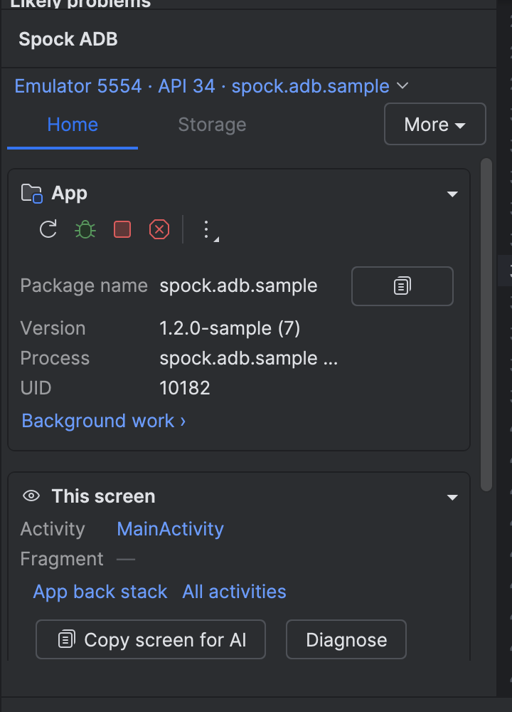
  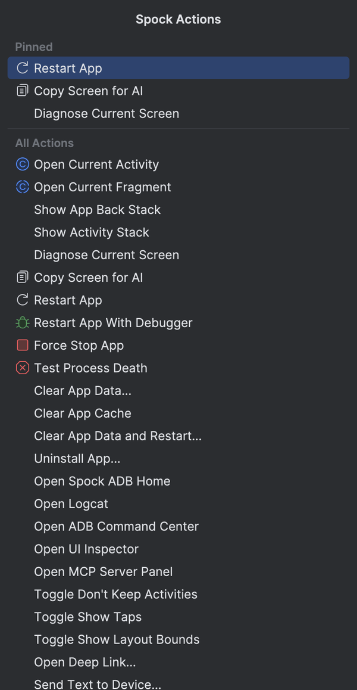

  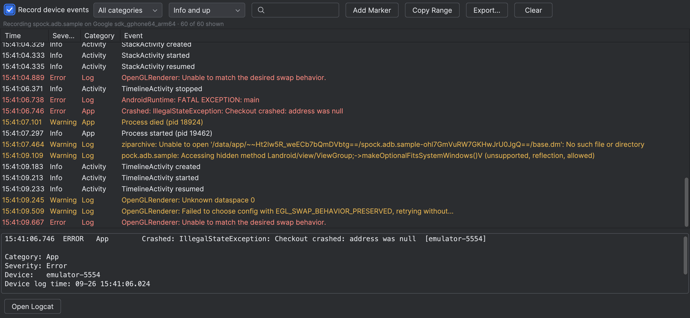

| Task                       | Without Spock ADB                        | With Spock ADB                    |
|----------------------------|------------------------------------------|-----------------------------------|
| Find current Activity      | `adb shell dumpsys...` + search output   | **Open Current Activity**         |
| Find current Fragment      | dumpsys / debug code / manual inspection | **Open Current Fragment**         |
| Restart / force stop       | Terminal ADB commands                    | **One action**                    |
| Test process death         | Manual ADB commands                      | **One action**                    |
| Manage permissions         | `pm grant` / `pm revoke`                 | **Visual permission controls**    |
| Inspect SharedPreferences  | `run-as` + shell + file editing          | **Browse & edit directly**        |
| Inspect DataStore          | Pull/read files manually                 | **Built-in typed editor**         |
| App-only Logcat            | Find PID + build filters                 | **App scope automatically**       |
| Investigate crashes / ANRs | grep/filter Logcat manually              | **Built-in filters**              |
| Inspect background work    | Read large `dumpsys` job/alarm output    | **Jobs and alarms in tables**     |
| Inspect UI hierarchy       | `uiautomator dump` + XML inspection      | **Visual UI Inspector**           |
| Check accessibility        | Manual inspection                        | **Built-in accessibility checks** |
| Send a deep link           | `adb shell am start ...`                 | **Open Deep Link**                |
| Send a test push message   | web console, token, payload form         | **Push message → Compose…**       |
| Change HTTP proxy          | `settings put/get ...`                   | **Proxy controls + verification** |
| Run ADB commands           | Leave the IDE for Terminal               | **ADB Command Center**            |
| Give AI access to Android  | Custom scripts / shell access            | **Structured MCP tools**          |

### The result

Workflows that normally require **several commands, copy/paste operations, PID lookups, and context switches** become one or two actions without leaving your editor.

---

# Everything you need for Android debugging

### 🏠 Home: the app, its screen and the device

The first tab of the **Spock ADB** window answers the questions you would otherwise run a command for, and puts the actions you use most in one row.

- **App** — version, process and UID, with **Restart**, **Attach debugger**, **Force stop** and **Process death** in a toolbar. **Clear cache**, **Clear data** and **Uninstall** sit behind **⋯**, never one click from Restart.
- **This screen** — the resumed activity and the app's fragments, read live, as links to their source; **App back stack**, **All activities**, **Diagnose**, and **Copy screen for AI**, which diagnoses and copies the redacted report in one click.
- **Permissions** — how many are granted, with **Manage…**, **Grant all** and **Revoke all…**.
- **Device** — Wi-Fi and mobile data, HTTP proxy, developer options (Don't keep activities, Show taps, layout bounds, animation scales), text input, deep links and push messages. Folded until you need it.

The device and app it acts on are the ones in the status bar: they follow Android Studio's run target by default, and a click changes them for every Spock window at once.

  

---

### 🔔 Push messages

**Home › Device › Push message → Compose…** sends a test FCM message straight to the app's messaging receiver over ADB — no web console, no registration token. Add data pairs, or a title and body for a notification message; paste an FCM request or edit it as JSON; save payloads per project; send to one device or all of them. The result says, per device, whether the message was **accepted** or **refused**.

  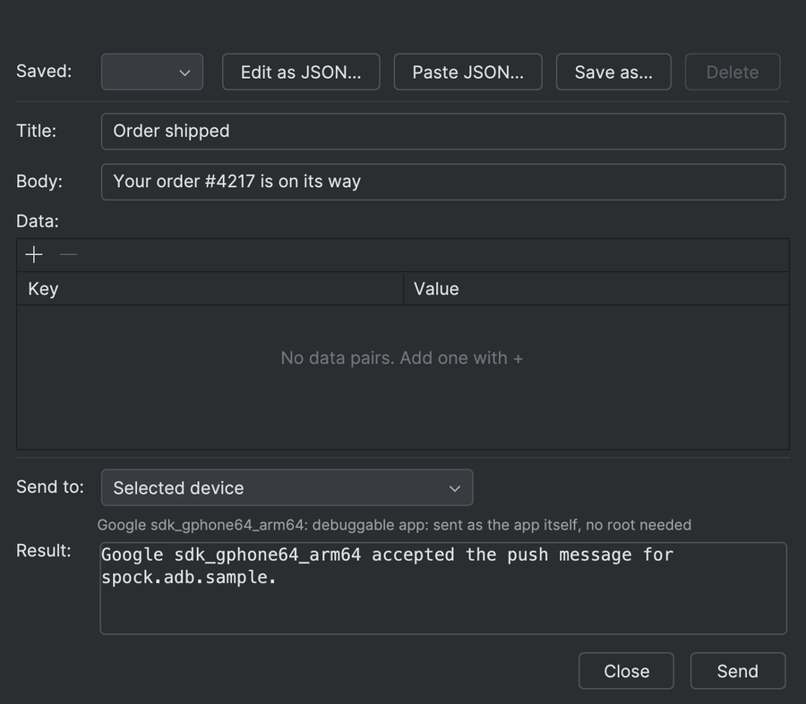
  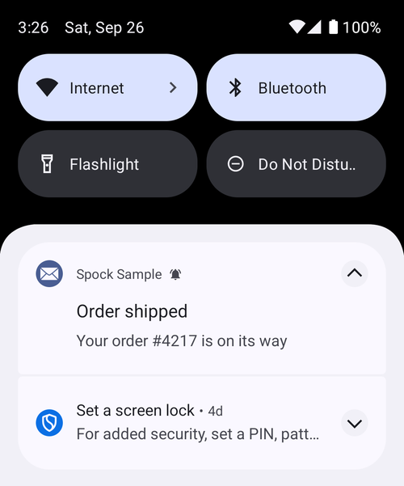

---

### 🗂 App Storage

Inspect your app's private storage directly from the IDE.

Browse:

`shared_prefs/` · `files/` · `databases/` · `cache/` · `DataStore`

Edit supported **SharedPreferences and Preferences DataStore** values using typed fields instead of manipulating files through `adb shell run-as`.

Changes are checked, written, and read back instead of assuming the command worked.

  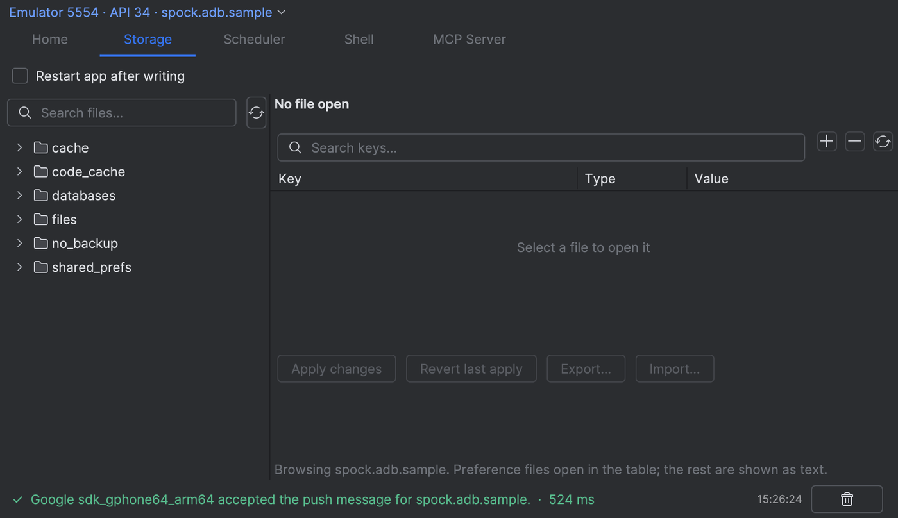

---

### 📜 Logcat, without the noise

**Spock Logcat** docks at the bottom of the IDE, beside the actions that produce the log, and starts with the **selected app**, not the entire device.

Choose the scope you actually need:

**App** — only your application's processes
**Related** — your app + relevant Android system components
**All** — the full device log

Then narrow it further with:

**Errors · Crashes · ANRs · Network · Search · Regex**

No manual PID lookup.
No giant `adb logcat | grep ...` commands.

  

---

### ⌨️ Shell

Still need the shell? The **Shell** tab of the Spock ADB window is an ADB command center.

Run ADB commands inside the IDE with:

**Autocomplete with docs · Device targeting · History · Favourites · Timeout · Cancellation · Searchable output · Execution status**

Start typing and Spock suggests what comes next — commands, subcommands, flags, key codes and
the device's installed packages — with the usage and a one-line explanation of each one, so you
no longer have to remember whether it was `pm clear` or `am clear`. **↑/↓** to choose, **Tab**
(or **Enter** once chosen) to insert, **Ctrl+Space** to ask, **Esc** to close.

You keep the power of ADB without constantly opening another terminal.

  

---

### 🩺 Diagnose Current Screen

**Spock Screen › Diagnose** — or **Diagnose** and **Copy screen for AI** on Home — reads everything about the screen in front of you, for the selected device and app:

**Current activity, activity stack and fragments · Screenshot · Likely problems from Logcat · UI and accessibility summary · Process state · Runtime permissions · Jobs and alarms · Doze, standby bucket, battery and charger**

Problems come first, ranked; a part that cannot be read is reported in place and never costs you the rest. From the summary go straight to **Open Activity**, **Open Fragment**, **Inspect UI** or **View Related Logs**, or **Copy for AI**. Agents get the same report from `android_diagnose_current_screen`.

  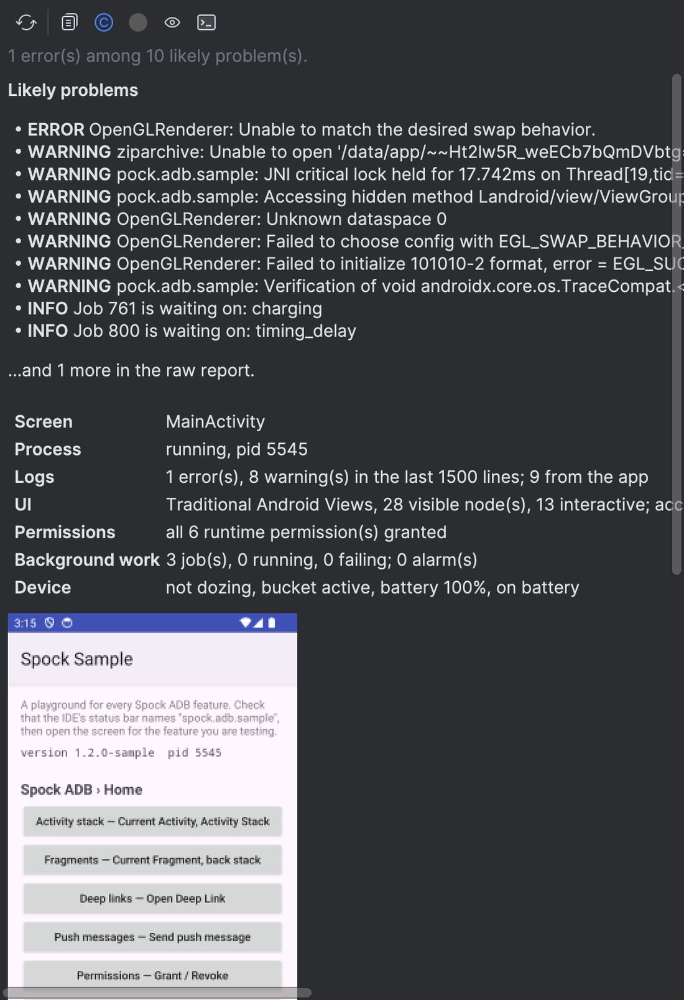

---

### 🕒 Debug Timeline

**Spock Logcat › Timeline** — what happened just before the bug, in one list and on one clock:

**Activity lifecycle and fragments · Process starts, deaths, crashes and ANRs · The app's warnings and errors · Actions run from Spock · Storage writes, jobs run and device-condition changes · Devices connecting · Agent tool calls · Your own markers**

Filter by category and severity, select an event for its detail and the tab it came from, and select two events to **Copy Range** or **Export** everything between them into a bug report. Device log times are moved onto the host's clock with a measured offset, so an action and the log line it caused appear in the order they happened. The history is bounded and says when the oldest events were dropped. Agents read the same list with `android_get_debug_timeline`.

  

---

### 🔍 UI Tree

**Spock Screen › UI Tree** inspects the UI currently running on the device.

Supports:

**Android Views · Jetpack Compose · Hybrid screens**

Inspect text, content descriptions, bounds, test tags, interaction state, and other semantics — with sizes in dp, whether each element is actually in view, and which device, window and moment the capture came from.

Select an element to copy a selector for it — MCP arguments, a Compose test finder, or a UI Automator selector — checked against the captured screen, so one that would match several elements says so before you paste it.

**Jump to Source** opens the code that drew the selected element, found in the open project by its test tag, resource id, text, or View class.

**Recompositions** records a Compose app for a few seconds and lists how many times each composable composed or recomposed, with its source line, from Compose's own composition tracing. The app needs `androidx.compose.runtime:runtime-tracing` and `androidx.tracing:tracing-perfetto-binary` in its debug build.

Spock ADB can also detect common accessibility problems such as:

**Missing labels · Duplicate labels · Touch targets below 48dp**

  

---

### ⏱ Scheduler

The **Scheduler** tab shows what's actually scheduled to run on the device.

Inspect:

**Scheduled jobs (JobScheduler & WorkManager) · Pending alarms**

Run a supported job on demand instead of waiting for the system to trigger it, and inspect — with a reset — the device conditions that gate background work:

**Doze · App Standby buckets · Battery level (presets or slider) · Per-charger AC/USB/wireless toggles**

  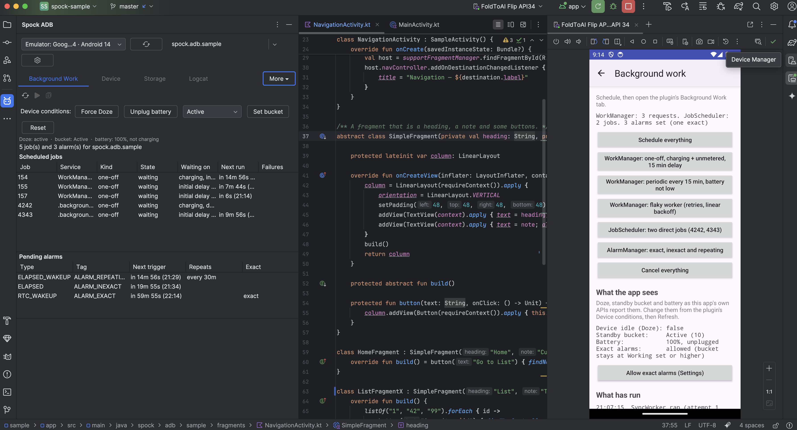

---

### ⚡ Spock Actions

Every Spock ADB action in one searchable popup, from the main toolbar or a shortcut you bind in the keymap: your pinned actions first, then the last five you used, then all of them — restart, clear data, process death, the developer-option toggles, open a deep link, send text, copy the screen for AI. They act on the device and app in the status bar, with every tool window closed.

  

---

### 🤖 Android debugging for AI agents

Spock ADB includes a built-in **MCP server** for tools such as Claude Code, Claude Desktop, Cursor, and other MCP clients.

Instead of giving an AI agent unrestricted shell access, Spock ADB exposes **67 structured Android debugging tools**.

Agents can inspect things such as:

**Activity · Fragment · UI tree · Logcat · Screenshots · Storage · Background work · Device state**

and perform actions such as:

**Launch · Tap · Input text · Deep links · App lifecycle operations**

Element actions refuse to guess between look-alike targets, can wait for the screen to change instead of sleeping, and can check that a tap had the effect it should — without ever sending it twice.

Sensitive or destructive operations can require approval, and MCP activity remains visible inside the IDE. The status bar shows the server's state — a green dot while it runs, amber when an agent is driving a different device from the one you selected — and a click starts or stops it, connects a client, or opens the agent activity.

  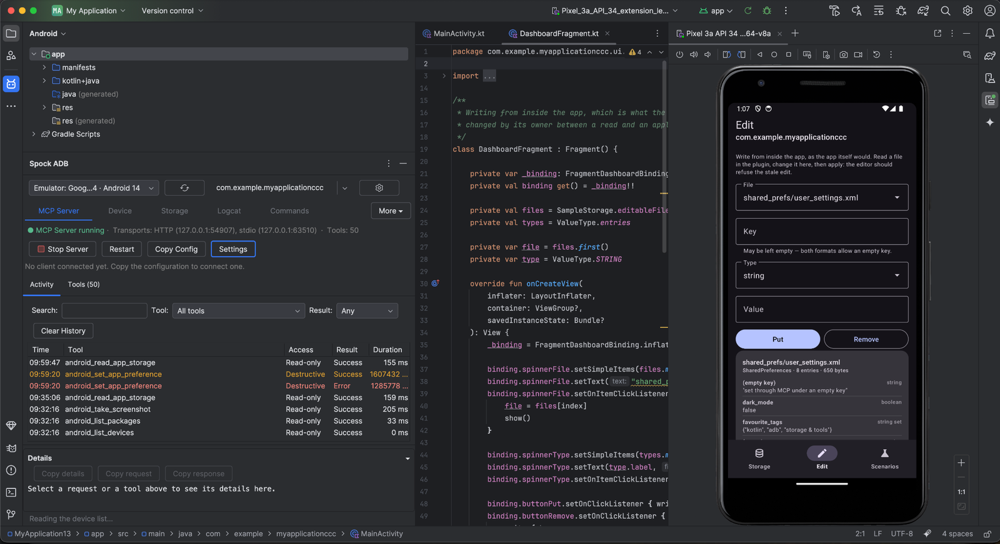

See [MCP documentation](docs/MCP.md) for setup, the complete tool list, and safety details.

To teach an agent *which* tools to call and in what order, install the [Spock ADB Agent Skill](skills/spock-adb/README.md): debugging playbooks for UI bugs, state bugs, crashes and ANRs, process death, background work, deep links and accessibility.

---

# Why use Spock ADB?

**Without Spock**

Android Studio
↓
Terminal
↓
Find the device
↓
Find the package
↓
Remember the ADB command
↓
Parse the output
↓
Switch back to the IDE

**With Spock**

Android Studio
↓
Select device + app
↓
**Run the action**

---

## Built for real debugging workflows

Spock ADB isn't an ADB command cheat sheet.

It provides a shared debugging workspace where **Home, Storage, Work, Shell, Logcat, Timeline, Diagnose, UI Inspector and MCP** all use the same selected Android device and application.

That means less setup, fewer targeting mistakes, and less time spent fighting your tools.

---

## Get started

1. Install **[Spock ADB](https://plugins.jetbrains.com/plugin/11591-spock-adb)** from the JetBrains Marketplace.
2. Connect a device or start an emulator.
3. Open the **Spock ADB** tool window.
4. Check the device and app in the status bar — Spock ADB picks your project's app and follows Android Studio's device; click it to choose another.
5. Debug.

> No Android project handy? `./gradlew -p sample :app:installDebug` builds the bundled [sample app](sample/README.md) — every plugin feature has a labeled screen to try it against.

**Spend less time operating ADB. Spend more time debugging your app.**

---

## Documentation

[MCP setup & tools](docs/MCP.md) · [IDE compatibility](docs/COMPATIBILITY.md) · [Release history](CHANGELOG.md) · [Contributing](CONTRIBUTING.md)

## License

Spock ADB is available under the [Apache License 2.0](LICENSE).
