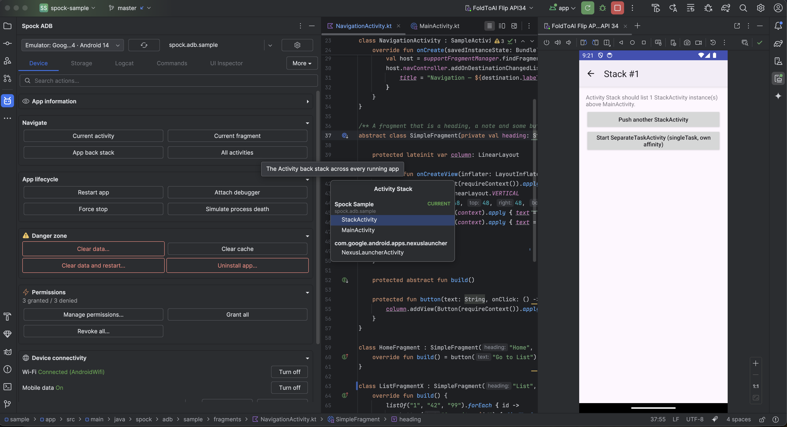
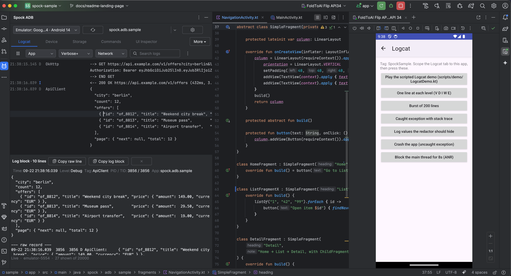
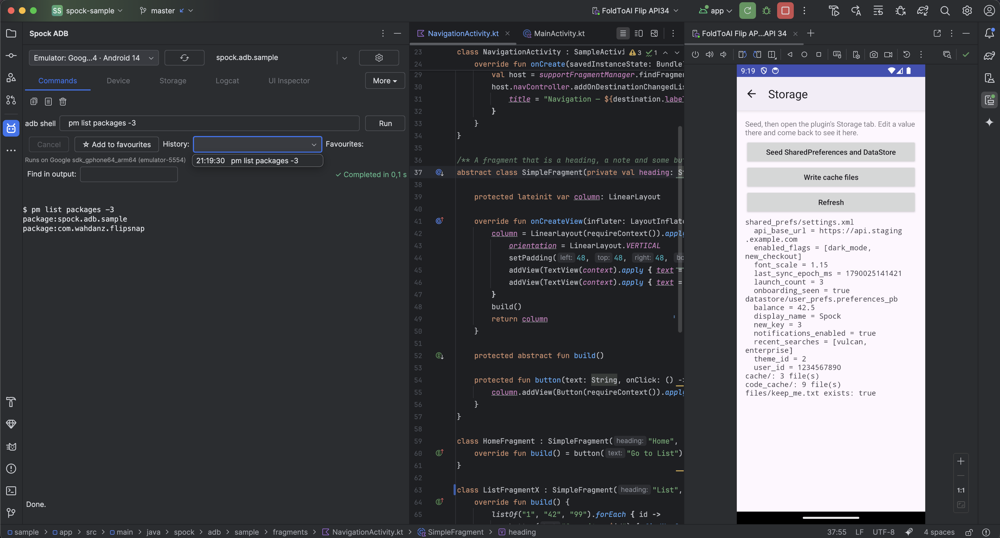
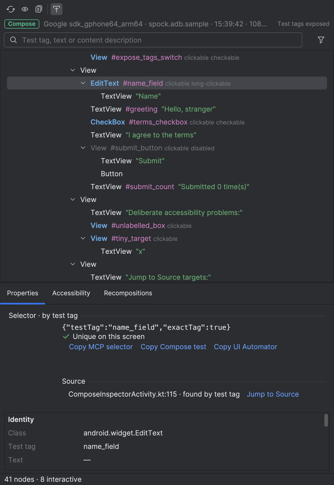
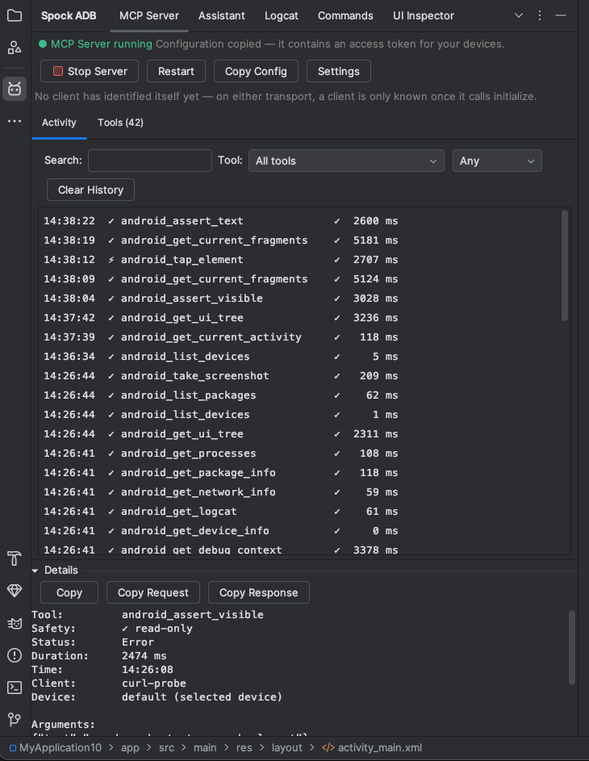

[](https://github.com/WahdanZ/SpockAdb/actions)
[](https://plugins.jetbrains.com/plugin/11591-spock-adb)
[](https://plugins.jetbrains.com/plugin/11591-spock-adb)

# Spock ADB

<!-- Plugin description -->
Full control of your Android device directly from your IDE — no terminal needed.

Spock ADB puts the most common ADB workflows into a single tool window: navigate to the active Activity or Fragment in your editor, manage app lifecycle, stream logcat, run ADB commands, and inspect the UI of Views <em>and</em> Jetpack Compose screens.

It also ships an <b>Android MCP server</b>: give Claude Code, Claude Desktop, Cursor or any MCP client safe, structured access to a connected device. 42 strongly typed tools rather than a raw shell, and anything destructive asks you first, every time.

Works in Android Studio and IntelliJ IDEA.
<!-- Plugin description end -->



---

## Why

Everything here is one keystroke or one click away from where you already are. No switching to a
terminal, no remembering `adb shell dumpsys activity activities | grep …`, and no guessing which
of three attached devices a command just hit — every operation names its target.

**New in 4.0**

- **Works in IntelliJ IDEA**, not just Android Studio
- **Logcat** and an **ADB Command Center** in the tool window
- **UI Inspector** for Views *and* Jetpack Compose
- **Android MCP server** — safe, structured device access for AI agents
- Every operation is an **IntelliJ Action**, bindable in Keymap

---

## The tool window

### Devices

Model, Android version, API level, architecture, and whether each device is an emulator or a
handset — with offline and unauthorized devices labelled as such. Your selection persists
between sessions, and every other tab targets it.

| | |
|---|---|
| **Open Current Activity** | Jump to the Activity on screen, in your editor |
| **Open Current Fragment** | Jump to the visible Fragment, nested ones included |
| **Back stacks** | The app's Activity/Fragment stack, or the system-wide one |
| **Restart / Force Stop / Test Process Death** | App lifecycle, one click each |
| **Clear Data · Uninstall** | Destructive — always confirmed, and the prompt names the device |
| **Permissions** | Toggle runtime permissions individually, or grant/revoke all |
| **Developer options** | Show Taps, Layout Bounds, Don't Keep Activities, animation scales |
| **Network** | Toggle Wi-Fi and mobile data |
| **Input text · Open deep link** | Type on the device, or fire an `ACTION_VIEW` intent |

### Logcat



Scoped to the app in your project by default — this is the part Android Studio's Logcat window
doesn't do for you.

- Presets for **Current app**, **Errors only**, **Crashes**, **ANRs**, **Network**
- Filters by **process ID**, not by text-matching the package name — text matching both misses
  lines and returns unrelated ones
- Level, tag, plain-text and regex search. An invalid regex matches nothing and says so, rather
  than silently showing an unfiltered log
- Crashes and ANRs are colour-coded; pause, clear, copy, export, auto-scroll

### Commands



Any `adb shell` command, with the things a terminal gives you and a tool window usually doesn't:
a real timeout, a **Cancel button that actually stops the command**, de-duplicating history,
favourites, and searchable output.

Destructive commands are flagged **as you type**, not only in a dialog after you press Run.

### UI Inspector



Inspect what is on screen — and it works for **Jetpack Compose**, because it reads the
accessibility tree where Compose publishes its semantics rather than assuming a View hierarchy.

- Says outright whether the screen is **Views**, **Jetpack Compose**, or **hybrid**
- Browse and search the semantics tree; filter to interactive elements
- Per-node test tag, text, content description, bounds and every interactive flag
- **Accessibility audit** — unlabelled controls, sub-48dp touch targets, duplicate labels — each
  with a fix appropriate to the framework (`Modifier.semantics` on Compose, not
  `android:contentDescription`)

> The screenshot above is a real Compose app: the panel reports the framework, and because
> the app hasn't opted into `testTagsAsResourceId` it says so and gives the fix, instead of
> showing an empty column and leaving you to work out why.

### MCP Server



Give an AI agent — Claude Code, Claude Desktop, Cursor — safe, structured access to a connected
device. **Off by default**; you start it deliberately.

- **42 strongly typed tools** instead of a raw shell, so an agent can reason about what an
  operation *means* and you can audit it
- **Live activity monitor**: every call with a safety marker, outcome and duration. Expand one to
  see arguments, result, client, target device — and whether you approved or denied it
- **Tools catalogue** grouped by safety, browsable before you start the server
- Searchable, bounded request history
- **HTTP and stdio**, served by one protocol implementation and one tool registry. The stdio
  configuration carries no token at all, so it is safe to paste anywhere

**Destructive tools always ask, per call, and default to denied.** An unattended IDE denies
rather than approves.

| | |
|---|---|
| ✓ **Read-only** | Device info, packages, logcat, screenshots, UI tree — run automatically |
| ⚡ **Actions** | Launch, tap, input text, deep links — run automatically |
| ⚠ **Destructive** | Clear data, uninstall, revoke permission, arbitrary shell — **always confirmed** |

See **[docs/MCP.md](docs/MCP.md)** for setup, the full tool list, the safety model and example
agent workflows.

---

## Keyboard shortcuts

Every operation is an IntelliJ Action, so it shows up in **Find Action** and in
`Settings → Keymap → Spock ADB`.

**No default shortcuts ship.** A binding that's free in one keymap is taken in another, and a
plugin silently claiming a combination you already use is worse than shipping none — so you
assign your own. `Settings → Tools → Spock ADB` shows what's currently bound.

Actions are context-aware: they disable themselves and say why, for example
*"Restart App — no Android device connected"*.

---

## Supported IDEs

| IDE | Versions |
|---|---|
| **Android Studio** | 2023.1 (Hedgehog) and later |
| **IntelliJ IDEA** | 2023.1 and later, with the bundled Android plugin |

Every release is checked against **five IDE builds** with JetBrains Plugin Verifier before it
ships. See [docs/COMPATIBILITY.md](docs/COMPATIBILITY.md) for the matrix and the reasoning.

> `Restart App With Debugger` needs the Android Studio execution tooling. It's available in all
> supported Android Studio versions and IntelliJ IDEA 2025.1+, and hides itself where it isn't.
> Everything else works everywhere.

---

## Installation

**JetBrains Marketplace:** [Spock ADB](https://plugins.jetbrains.com/plugin/11591-spock-adb)

Or from your IDE: `Settings → Plugins → Marketplace → search "Spock ADB"`

## Quick start

1. Open an Android project and connect a device or start an emulator.
2. Open the **Spock ADB** tool window (left-hand sidebar, or `Tools → SpockAdb`).
3. Pick your device in **Devices** — every other tab follows it.
4. Optional: `Tools → SpockAdb → Start MCP Server for AI Agents`, then
   **Copy MCP Client Configuration (stdio)** — or **(HTTP)** — and paste it into your MCP client.

---

## Troubleshooting

**The device list is empty.** Check `adb devices` sees it. The list refreshes whenever the tool
window becomes visible, so switching away and back re-reads it. If a device is attached but not
listed, `Help → Show Log in Finder/Explorer` will have the ADB error — failures are logged.

**A device shows as `unauthorized`.** Accept the USB debugging prompt on the device. Actions
ignore devices that aren't ready and tell you which ones and why.

**"Could not determine the application ID."** The plugin reads it from the Android module in the
open project — open an Android project and let Gradle sync finish.

**`Restart App With Debugger` is missing.** Your IDE doesn't ship the Android Studio execution
tooling; the action hides itself rather than failing. Everything else still works.

**UI Inspector says it can't dump the UI.** `uiautomator` can't capture while the screen is off,
a secure window (payment, password) is showing, or the UI is mid-animation.

**Compose test tags aren't shown.** The app has to opt in with
`Modifier.semantics { testTagsAsResourceId = true }`. Until then, match on text or content
description — the panel says so too.

---

## Documentation

| Document | Contents |
|---|---|
| [docs/MCP.md](docs/MCP.md) | MCP server: setup, tools, safety model, Compose support, agent workflows |
| [docs/COMPATIBILITY.md](docs/COMPATIBILITY.md) | Supported IDE range, verification matrix, how to change it safely |
| [CONTRIBUTING.md](CONTRIBUTING.md) | Development setup, threading rules, release process |
| [CHANGELOG.md](CHANGELOG.md) | Release history |

## Development

```bash
./gradlew runIde         # launch a sandboxed IDE with the plugin
./gradlew test           # unit tests
./gradlew detekt         # static analysis
./gradlew verifyPlugin   # Plugin Verifier across all supported IDEs
./gradlew buildPlugin    # produce the installable zip
```

---

## Demo

[](http://www.youtube.com/watch?v=x_WX_Pznqos)

---

## License

```
Copyright 2019 Ahmed Wahdan

Licensed under the Apache License, Version 2.0 (the "License");
you may not use this file except in compliance with the License.
You may obtain a copy of the License at

   http://www.apache.org/licenses/LICENSE-2.0

Unless required by applicable law or agreed to in writing, software
distributed under the License is distributed on an "AS IS" BASIS,
WITHOUT WARRANTIES OR CONDITIONS OF ANY KIND, either express or implied.
See the License for the specific language governing permissions and
limitations under the License.
```
